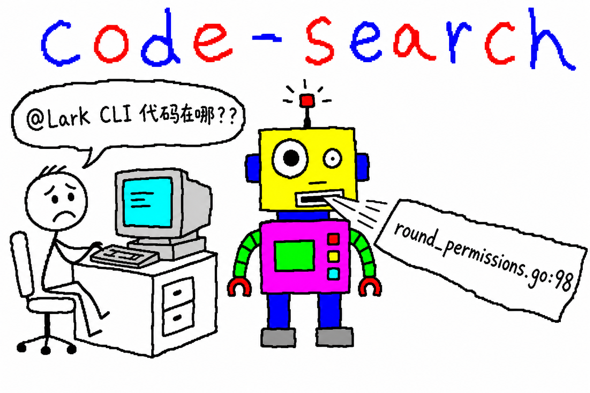

# code-search

> 让你的 AI agent 通过飞书「代码查询」群，远程查询公司全量代码镜像——跨仓库追上下游、定位接口实现、分析改动影响面，回答精确到 **仓库 / 文件 / 行号**。



## 它解决什么问题

本地只 clone 了一两个仓库，但问题横跨整条链路：

- 「`/ops/round/add` 这个接口的 `rValue` 改成数组，会牵连哪些仓库哪些文件？」
- 「前端这个页面调的是后端哪个接口？」
- 「这段报错日志对应哪段代码？」
- 「`CanViewOdds` 定义在哪？上游谁在调？」

公司全量代码镜像在远端 `/var/lib/codex-review/work/`，飞书「代码查询」群里的 **Lark CLI** 机器人接到 @ 提问后检索镜像，几分钟内回复文件路径 + 行号 + 关键代码的完整分析。

装上本 skill 后，你只要**跟自己的 agent（Claude Code / Cursor 等）说人话**，发问、@ 机器人、等回复、整理答案全部由 agent 自动完成——回复到达时 agent 会被自动唤醒，不用人盯群。

## 安装

### ① 装 skill（一次）

```bash
npx skills add pw-OpenCapsule/code-search -g
```

### ② 前置：lark-cli（没装过才需要）

```bash
npx @larksuite/cli@latest install
lark-cli config init --new      # 输出授权链接，浏览器里点完即可
lark-cli auth login --recommend # 同上
lark-cli auth status            # 验证
```

详细图文指引见 [Lark-cli 安装文档](https://portwind.jp.larksuite.com/wiki/JVLmw2zdXiM455kl1TqjuWW8p3b)。装了 skill 之后这一步也可以直接让 agent 带你走完。

### ③ 加入「代码查询」群（一次）

[点这里加入](https://applink.larksuite.com/client/chat/chatter/add_by_link?link_token=d68s12ba-a2f6-46a2-a4ba-a1042ekmi29k)。不加群发不了问题，agent 检测到你没入群时也会把这个链接发给你。

## 用法 — 跟 agent 说

| 场景 | 你说 |
|------|------|
| 查定义 / 调用点 | 帮我查下 wininfuture-service 里 `CanViewOdds` 定义在哪、谁在调 |
| 查改动影响面 | `/ops/round/add` 的 rValue 入参改成数组，影响面有多大？去代码查询群问下 |
| 前后端对应 | 管端「对局编辑」页面对应后端哪个接口？ |
| 报错定位 | 这段报错对应哪段代码？（贴日志） |
| 指定分支 | 基于 feature/xxx 分支查……（不说分支默认查 dev） |

agent 会自动：定位群 → @Lark CLI 机器人发问（带上分支）→ 后台等回复（3～10 分钟，期间继续干别的活）→ 回复到达自动唤醒 → 校验分支 → 整理成结构化答案给你。

## 实际效果

提问（agent 代发）：

> wininfuture-service 里 CanViewOdds 这个函数定义在哪个文件哪一行？有哪些调用点？ @Lark CLI

约 3 分钟后机器人回复：

> 定义：`internal/permissions/round_permissions.go:98`
> 调用点（origin/dev）共 3 处：
> `internal/service/game_service.go:162` / `game_service.go:435` / `predict_service.go:363`
> （含每处的关键代码片段，并注明所查分支）

## 提问质量直接决定答案质量

机器人没有你的本地上下文，问题必须自包含：

- ✅ 带 接口路径 / 方法名 / 类名 / 报错关键字
- ✅ 带 项目名或业务名 + **分支名**（最容易踩的坑——不带分支默认查 `origin/dev`）
- ✅ 固定加一句「请注明你实际查询的分支」
- ❌ 一次塞多个问题
- ❌ 在群里闲聊（机器人只回代码问题）

## 仓库结构

```
code-search/
├── SKILL.md              # agent 读的技能定义（npx skills add 装的就是它）
├── scripts/
│   └── wait-reply.sh     # 轮询等回复脚本：回复集齐即退出，唤醒 agent
└── README.md
```

## 工作机制（给好奇的人）

1. `lark-cli im +chat-search` 定位「代码查询」群，`chat.members bots` 解析机器人 open_id
2. `+messages-send --as user` 发问，`<at>` 标签 @ 机器人，记下 `message_id`
3. `scripts/wait-reply.sh` 以**后台任务**运行：每 20 秒拉一次群消息，筛 `reply_to == 提问 message_id` 的机器人回复；长答案的 `(1/2) (2/2)` 分片集齐才算完成；完成即退出 → agent 被唤醒
4. agent 校验机器人实际查询的分支后，整理成结构化结论

为什么用轮询而不是事件长连接：lark-cli 是全员共享的同一个飞书应用，事件在同一应用的多个长连接间**负载均衡**——本地建连接会随机抢走服务端答题机器人的事件，弄坏整个查询服务。所以严禁 `event consume`，轮询是唯一安全方式。

## 相关项目

- [openapi-lark](https://github.com/pw-OpenCapsule/openapi-lark) — OpenAPI 接口文档同步到飞书 wiki（查接口文档用它，查代码用本项目）
- [lark-cli](https://www.npmjs.com/package/@larksuite/cli) — 本 skill 依赖的飞书命令行

## License

MIT
